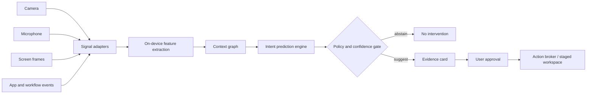

# SAGE technical architecture

## 1. System view

The architecture is deliberately layered. Raw inputs are not passed directly to a generative model. Adapters normalize events, feature extractors reduce data, the graph stores a short-lived episode, and the intent engine ranks bounded workflow actions.

## 2. Input layer

### Camera

A low-rate presence and posture adapter extracts coarse features such as present/not present, orientation, and attention transition. It should not retain face images or infer sensitive attributes. Camera inference is event-triggered and can be disabled independently.

### Microphone

A local audio scene classifier detects speech activity, quiet workspace, meeting-like activity, or interruption. Speech-to-text runs only after an explicit speech or hotkey policy; ambient audio is not stored as a transcript.

### Screen understanding

A sampler captures selected regions or accessibility/UI metadata rather than a continuous recording. OCR, layout detection, and a lightweight visual encoder produce application, document, and task embeddings. Password fields, private browsing, and user-selected applications are redacted at the adapter boundary.

### Application and workflow signals

Window focus, document path, editor selection, compile/test state, file recency, keyboard/mouse bursts, and explicit user events are high-value low-cost signals. These signals are often more reliable for workflow continuation than a large visual model.

## 3. AI processing layer

| Component | Prototype role | Production role | Runtime |
|---|---|---|---|
| Vision encoder | simulated screen-focus signal | screen region and UI embedding | NPU |
| Audio scene / speech | simulated quiet scene | scene classification plus gated ASR | NPU, CPU for I/O |
| Small language model | deterministic copy | intent label, evidence extraction, constrained rationale | NPU |
| Embedding model | simulated relevance score | semantic retrieval over local episodes | NPU |
| Context graph | in-memory sample | SQLite/event store plus vector index | CPU/storage |
| Intent engine | ranked fixed scenario | calibrated classifier/ranker with no-op class | NPU + CPU |
| Policy gate | UI approval button | consent, confidence, cooldown, sensitive-app policy | CPU |

### Context graph

A graph node represents an event or artifact: `window`, `document`, `speech_segment`, `screen_region`, `task`, or `decision`. Edges encode `opened_after`, `related_to`, `unresolved`, `same_episode`, and `caused_by`. Each node has a retention deadline and provenance. The graph is not a user profile; it is a bounded working set.

### Intent score

A practical first model can rank candidate intents with calibrated features:

$$
P(i \mid x_{1:t}) = \operatorname{softmax}(W[\text{recency},\text{continuity},\text{unresolvedness},\text{similarity},\text{presence},\text{cost}])
$$

The system shows a suggestion only when the top candidate is sufficiently separated from alternatives and its expected utility exceeds interruption cost. A no-op candidate is always present.

### Advanced product primitives

- **Focus Shield:** a local policy state that raises the intervention threshold to infinity for proactive suggestions while preserving explicit user actions. It is useful during meetings, deep work, presentations, or accessibility-sensitive moments.
- **Context Capsule:** a versioned, user-initiated export of a redacted episode. It contains semantic signals, intent candidates, confidence, provenance, and retention metadata; raw media and sensitive application content are excluded at serialization time.
- **Intent ledger:** every suggestion, abstention, dismissal, and approval becomes a short-lived decision event. This enables calibration and interruption-cost measurement without retaining raw sensor streams.
- **Energy-aware scheduling:** frequent low-cost features run on the NPU; richer vision or language passes are deferred until signal disagreement or an intent boundary justifies the energy cost.

These primitives make SAGE distinct from a general assistant: the core object is a controllable decision boundary around a workflow, not a generated response.

## 4. Snapdragon execution plan

- **NPU:** quantized vision, audio, embedding, and small language inference. Keep models resident where possible to avoid repeated transfers.
- **CPU:** event routing, graph writes, policy evaluation, encryption, UI integration, and low-cost feature logic.
- **GPU:** optional burst workloads such as richer screen layout analysis or visual preview; never required for the core always-available path.
- **Memory:** ring buffers for raw sensor data, compact embeddings for episodes, and encrypted metadata with TTL deletion.

The Snapdragon value proposition is not simply that a model runs faster. It is that a heterogeneous, low-power compute budget makes ambient inference viable while keeping raw context local and preserving battery life.

## 5. Model and deployment strategy

Model availability changes, so the implementation should pin exact artifacts during development and benchmark them on the target HP Snapdragon SKU. Candidate families include:

- **Qualcomm AI Hub:** select current, device-compatible image encoders, speech models, object/UI models, and small transformer artifacts from the AI Hub catalog. The catalog is the source of truth for supported Snapdragon target, operator coverage, and performance.
- **Vision:** MobileViT, EfficientViT, or a compact CLIP-style encoder exported to ONNX and compiled through Qualcomm AI Engine Direct/QNN where supported.
- **Speech:** a small Whisper-family or Qualcomm-supported ASR artifact for explicit speech capture, plus a tiny audio scene classifier for ambient state.
- **Small language model:** a 1B-3B instruct model, or a task-specific encoder/classifier, quantized for constrained intent labels rather than free-form response generation.
- **Embeddings:** a compact MiniLM/E5-style text encoder or multimodal embedding model sized for local retrieval.

The competition build should prove the architecture with the smallest supported models first. Do not make a model name the innovation.

### Quantization and compilation

1. Export PyTorch models to ONNX with static shapes for the common input paths.
2. Validate numerical parity on representative screen, audio, and event fixtures.
3. Apply INT8 post-training quantization with calibration data that reflects desktop UI and indoor audio.
4. Use QNN conversion and the Snapdragon execution provider or Qualcomm AI Engine Direct path appropriate to the target SDK.
5. Profile end-to-end latency, NPU utilization, memory, and energy rather than only model throughput.
6. Keep a CPU fallback and expose accelerator state in the product diagnostics.

Avoid quantizing the entire pipeline blindly. The highest-value path is usually small, frequent, and stable; richer models can be event-triggered.

## 6. Privacy and safety contract

- Raw frames/audio remain in volatile buffers unless the user explicitly saves an artifact.
- Every sensor has an independent consent switch and visible state.
- Sensitive applications, password fields, meetings, and private browsing default to redaction or pause.
- Episodes expire automatically; users can inspect and clear the current thread.
- Suggestions show evidence and confidence; consequential actions require approval.
- Telemetry is opt-in and should report aggregate performance, not content.

## 7. Prototype roadmap

### Phase 1 / context collection

Build Windows adapters for foreground app, file activity, accessibility metadata, microphone scene, and camera presence. Store normalized events in a local encrypted SQLite schema with TTLs.

### Phase 2 / multimodal understanding

Add screen-region sampling, OCR/UI layout, local embeddings, and a compact episodic graph. Benchmark each adapter independently and define redaction fixtures.

### Phase 3 / intent prediction

Create a scenario taxonomy with 5-8 bounded intents: continue research, prepare meeting, resume code debugging, collect evidence, summarize only as an internal step, or no-op. Train/calibrate a ranker on replayable synthetic and volunteer traces.

### Phase 4 / real-time demonstration

Compile the selected models for the target Snapdragon HP PC, show accelerator and power telemetry, and run the complete flow: sensing, evidence, prediction, approval, staging, and clear-memory control.

### Suggested stack

- Python for model evaluation, fixtures, and benchmarking
- C++/WinRT or Rust for low-level Windows capture and policy services
- TypeScript/React or WinUI 3 for the companion surface
- ONNX Runtime with QNN execution provider / Qualcomm AI Engine Direct
- SQLite plus a small vector index for local memory
- GitHub Actions for fixture tests; device profiling on physical Snapdragon hardware

### Hardware requirement

A Snapdragon X-series HP PC with NPU support, Windows 11, camera, microphone, and access to Qualcomm profiling/deployment tooling. Development can begin on CPU, but any claim about NPU latency, energy, or thermals must be measured on the target device.
